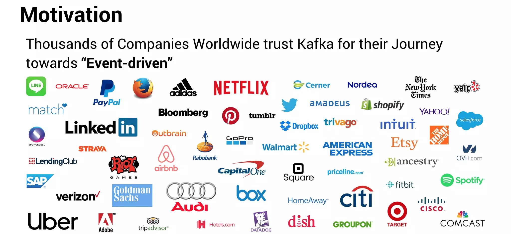

# Kafka Chronicles: Demystifying the Heartbeat of Modern Tech

Welcome to Kafka Chronicles, a deep dive into the world of Apache Kafka! 🚀

## About This Series

Ever wondered how tech giants like Netflix, Uber, LinkedIn, and Airbnb manage their massive data streams in real-time? The answer lies in Apache Kafka, and we're here to unravel its mysteries!

This blog series will take you on an exciting journey through the ins and outs of Kafka, from basic concepts to advanced implementations. Whether you're a curious beginner or a seasoned developer, there's something here for everyone!

## What to Expect

🎯 Clear, concise explanations
🔧 Practical examples and use cases
💡 Industry insights and best practices
🚀 From basics to advanced topics

## Blog Series Overview

1. **Kafka Unveiled: Powering the Pulse of Modern Tech Giants**
   - Introduction to Kafka
   - Real-world applications
   - Key terminology

2. **Kafka Architecture: The Building Blocks of a Data Streaming Powerhouse**
   - Topics, partitions, and brokers
   - Producers and consumers
   - Kafka clusters

3. **Kafka in Action: Setting Up Your First Kafka Environment**
   - Installation guide
   - Basic configurations
   - Your first Kafka producer and consumer

4. **Scaling with Kafka: Handling Millions of Events per Second**
   - Partitioning strategies
   - Replication and fault tolerance
   - Performance tuning

5. **Kafka Streams: Real-Time Data Processing Made Easy**
   - Introduction to Kafka Streams
   - Building your first streaming application
   - Windowing and state management

6. **Kafka Connect: Integrating Kafka with External Systems**
   - Overview of Kafka Connect
   - Setting up source and sink connectors
   - Popular connectors and their use cases

7. **Kafka Security: Protecting Your Data Pipeline**
   - Authentication and authorization
   - Encryption and SSL
   - Audit logs and monitoring

8. **Kafka in the Cloud: Deploying Kafka on AWS, Azure, and GCP**
   - Comparison of cloud offerings
   - Deployment best practices
   - Managed Kafka services

9. **Advanced Kafka: Beyond the Basics**
   - Exactly-once semantics
   - Transactions in Kafka
   - Custom serializers and deserializers

10. **The Future of Kafka: Trends and Predictions**
    - Upcoming features
    - Kafka's role in emerging technologies
    - Community insights and expert opinions

Stay tuned as we roll out these exciting posts! Don't forget to star this repo and watch for updates.

## Contribute

Found a typo? Have a suggestion? Feel free to open an issue or submit a pull request!

## License

This project is licensed under the MIT License - see the [LICENSE.md](LICENSE.md) file for details.

---

Happy Kafka-ing! 🎉